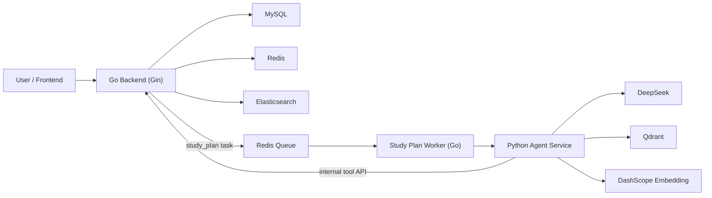

# Gojo OJ

一个面向在线判题场景的全栈练手项目。  
项目主线已经不只是传统 OJ，而是扩展成了一个带有 AI 诊断、训练规划、RAG 检索和文本记忆能力的学习辅助系统。

当前仓库已经实现两条核心 AI 业务线：

- `analysis`：针对单次提交结果做错误诊断和解释
- `study_plan`：基于用户历史、规则召回、语义召回和文本记忆生成个性化训练计划

---

## 目录

- [项目定位](#项目定位)
- [当前完成能力](#当前完成能力)
- [整体架构](#整体架构)
- [技术栈](#技术栈)
- [目录结构](#目录结构)
- [核心业务说明](#核心业务说明)
- [本地启动](#本地启动)
- [配置说明](#配置说明)
- [RAG 与 Memory](#rag-与-memory)
- [主要接口](#主要接口)
- [调试与排查](#调试与排查)
- [已知取舍](#已知取舍)
- [后续方向](#后续方向)

---

## 项目定位

这个项目不是一个“只有几个 CRUD 接口”的 OJ Demo，而是尽量把后端常见能力和 AI 工作流串起来：

- Gin + Gorm 分层后端
- MySQL / Redis / Elasticsearch / Docker
- 异步判题与异步 AI 任务
- Go 主系统 + Python AI 服务分层
- DeepSeek tool loop
- Qdrant 向量检索
- DashScope embedding
- 文本 memory
- 用户反馈与管理员统计闭环

适合用来展示这些能力：

- 后端工程化
- 异步任务链设计
- 多服务协作
- AI agent runtime 设计
- RAG / memory 在真实业务中的接入方式

---

## 当前完成能力

### OJ 基础能力

- 用户注册、登录、JWT 鉴权
- 题目列表、详情、标签管理
- 测试用例管理
- 代码提交、异步判题
- 排行榜
- Elasticsearch 题目搜索

### AI 能力

- 提交分析 `analysis`
  - 创建分析任务
  - 异步执行
  - 反馈与管理员统计

- 训练规划 `study_plan`
  - 创建训练计划任务
  - Redis 入队
  - worker 调 Python agent
  - 返回结构化训练计划
  - 用户反馈
  - 管理员统计

### RAG 能力

- 题目导出为 `document + metadata`
- DashScope `text-embedding-v3` 向量化
- Qdrant 存储题目向量
- 语义检索 demo
- 题目创建/更新/删标签/删除后自动增量同步到 Qdrant

### Memory 能力

- 基于 Qdrant 的非结构化文本记忆
- 按 `user_id` 检索历史训练计划
- 计划生成完成后自动写入记忆

---

## 整体架构



### 分层职责

#### Go 负责

- 用户、权限、JWT
- 业务主数据
- 题目、提交、排行榜
- task / queue / worker
- internal tool API
- feedback / stats

#### Python 负责

- AI runtime
- DeepSeek tool loop
- RAG 检索
- memory 读写
- 训练计划生成

### 为什么这样分层

这样拆分之后：

- Go 继续做业务真相源和系统骨架
- Python 专注 AI 推理和检索能力
- 两边边界清楚，不会把用户系统和 AI 流程揉成一团

---

## 技术栈

### 后端

- Go
- Gin
- Gorm
- MySQL
- Redis
- Elasticsearch
- Docker SDK

### AI / 检索

- Python
- FastAPI
- DeepSeek
- DashScope `text-embedding-v3`
- Qdrant

### 前端

- Vue 3
- Vite
- Axios
- Vue Router

---

## 目录结构

```text
gojo/
├─ agent/                         # Python AI 服务
│  ├─ app.py                      # FastAPI 入口
│  ├─ agent_runner.py             # study_plan agent 入口
│  ├─ deepseek_runner.py          # 手写 DeepSeek tool loop runtime
│  ├─ deepseek_tools.py           # DeepSeek tools schema
│  ├─ tool_executor.py            # tool 执行分发
│  ├─ client.py                   # 调 Go internal tool API
│  ├─ schemas.py                  # 请求/响应模型
│  └─ rag/
│     ├─ export_problem_docs.py   # 导出题目文档
│     ├─ index_problem_docs.py    # 批量写入 Qdrant
│     ├─ search_demo.py           # 最小检索 demo
│     ├─ search_service.py        # 语义检索服务层
│     ├─ index_service.py         # Qdrant upsert/delete 服务层
│     ├─ problem_doc_service.py   # 单题文档构建
│     └─ memory_service.py        # 文本 memory 检索/写入
├─ cmd/server/                    # Go 启动入口
├─ config/                        # Go 配置
├─ infrastructure/                # MySQL / Redis / ES / Qdrant 配置
├─ internal/
│  ├─ analysis/                   # analysis 业务
│  ├─ app/                        # 路由 / 中间件 / 统一响应
│  ├─ judge/                      # 判题
│  ├─ leaderboard/                # 排行榜
│  ├─ problem/                    # 题目 / 标签 / 搜索
│  ├─ study_plan/                 # 训练计划任务 / feedback / stats
│  ├─ submission/                 # 提交
│  └─ user/                       # 用户
├─ pkg/                           # JWT / AI provider 等公共组件
├─ vue/                           # 前端
├─ docker-compose.yml             # 本地基础服务与 Python agent
├─ .env.example                   # Python / Docker 环境变量模板
└─ README.md
```

---

## 核心业务说明

## `analysis`

目标：解释单次提交为什么错。

流程：

1. 用户创建分析任务
2. Go 写任务表并入队
3. worker 处理
4. AI 分析 submission 上下文
5. 返回诊断结果
6. 用户提交反馈
7. 管理员查看统计

这条业务更偏“诊断型 AI”。

---

## `study_plan`

目标：告诉用户接下来该练什么。

当前这条业务是本仓库最完整的 AI 主线。

### 业务链

1. 用户调用 `POST /api/study-plan/tasks`
2. Go 创建任务并推入 Redis 队列
3. `study_plan worker` 异步消费
4. worker 调 Python `/study-plan/run`
5. Python agent 调用 DeepSeek
6. DeepSeek 根据需要调用 tools
7. Python runtime 执行 tools、读 RAG、读 memory
8. 返回结构化训练计划
9. Go 回写 task 结果到 MySQL
10. 用户查询任务状态、提交反馈、管理员看统计

### 当前 `study_plan` agent 形态

不是 LangChain `create_agent`，而是：

- **手写 DeepSeek runtime**
- **LLM 自己决定是否调用工具**
- **代码负责控制循环、边界、收尾**

这样做的原因是：

- 对 DeepSeek tool calling 协议更稳定
- 更容易定位问题
- 能在保留 agent 决策能力的同时，避免框架黑盒兼容问题

### 当前可用 tools

- `user_ac_history`
- `user_failed_submissions`
- `user_tag_stats`
- `candidate_problems`
- `semantic_candidate_problems`
- `finish_study_plan`

其中：

- `candidate_problems`：规则/标签候选题召回
- `semantic_candidate_problems`：Qdrant 语义候选题召回
- `finish_study_plan`：结构化收尾

---

## 本地启动

## 1. 环境准备

请先准备：

- Go
- Node.js
- Python 不再要求本地单独装依赖来跑 agent 主链
- MySQL
- Docker Desktop

本项目当前推荐的运行方式是：

- MySQL：本地安装
- Go：本地运行
- Redis / Elasticsearch / Kibana / Qdrant / Python agent：Docker Compose

---

## 2. 创建数据库

```sql
CREATE DATABASE gin_demo CHARACTER SET utf8mb4 COLLATE utf8mb4_general_ci;
```

---

## 3. Go 配置

复制配置模板：

```powershell
Copy-Item config\config.example.yaml config\config.dev.yaml
```

然后至少修改：

- `sql.dsn`
- `jwt.secret`
- `ai.api_key`
- `ai.model`

当前 `study_plan` 也会读取：

```yaml
study_plan:
  worker_count: 3
  agent_base_url: "http://localhost:8000"
  agent_timeout_seconds: 60
```

注意：

- `study_plan.worker_count` 必须大于 `0`
- 否则任务会一直停在 `pending`

---

## 4. Python / Docker 配置

复制：

```powershell
Copy-Item .env.example .env
```

至少填写：

```env
DEEPSEEK_API_KEY=your_deepseek_key
DEEPSEEK_API_BASE=https://api.deepseek.com
LLM_MODEL=deepseek-v4-pro
GO_BACKEND_BASE_URL=http://host.docker.internal:8080
AGENT_DEBUG=false

DASHSCOPE_API_KEY=your_dashscope_key
EMBEDDING_MODEL=text-embedding-v3
EMBEDDING_DIMENSION=1024
QDRANT_URL=http://qdrant:6333
MEMORY_COLLECTION=study_plan_memories
MEMORY_TOP_K=3
```

---

## 5. 启动基础服务与 agent

### 启动 Redis / ES / Kibana / Qdrant / agent

```powershell
cd D:\beryl\letsgo\gojo
docker compose up -d redis elasticsearch kibana qdrant
docker compose build agent
docker compose up -d agent
```

### 查看 agent 日志

```powershell
docker compose logs -f agent
```

如果要打开调试日志：

1. 把 `.env` 里的 `AGENT_DEBUG=true`
2. 然后不要只 `restart`，而要：

```powershell
docker compose up -d --force-recreate agent
```

---

## 6. 启动 Go 后端

```powershell
$env:APP_ENV="dev"
go run .\cmd\server\main.go
```

启动成功后应看到：

- `server listening on :8080`
- `starting study plan worker pool, workers=3`

如果这里是 `workers=0`，说明配置没有读对，`study_plan` 任务会一直停在 `pending`。

---

## 7. 启动前端

```powershell
cd vue
npm install
npm run dev
```

默认地址通常是：

- [http://localhost:5173](http://localhost:5173)

---

## 配置说明

## Go 配置

Go 主程序主要读：

- [config/config.dev.yaml](/D:/beryl/letsgo/gojo/config/config.dev.yaml:1)

通过：

```powershell
$env:APP_ENV="dev"
```

选择环境文件。

同时支持环境变量覆盖，例如：

```powershell
$env:GOJO_SERVER_PORT="9090"
```

---

## Docker / Python 配置

Python agent 与 RAG 相关配置主要来自：

- [`.env.example`](/D:/beryl/letsgo/gojo/.env.example:1)
- [`.env`](/D:/beryl/letsgo/gojo/.env:1)

这些值会被：

- `docker-compose.yml`
- Python `dotenv`

共同使用。

---

## RAG 与 Memory

## 题目 RAG

当前题目 RAG 使用：

- DashScope `text-embedding-v3`
- Qdrant

### 题目文档结构

每道题会被整理成：

- `document`
- `metadata`

例如：

```json
{
  "problem_id": 3,
  "document": "Title: 有序数组查找\nTags: 二分, 数组\nDescription: ...",
  "metadata": {
    "title": "有序数组查找",
    "tags": ["二分", "数组"],
    "submit_count": 12,
    "accepted_count": 8,
    "time_limit": 1000,
    "memory_limit": 256
  }
}
```

### 初次全量导出与入库

```powershell
docker compose run --rm agent python rag/export_problem_docs.py --base-url http://host.docker.internal:8080
docker compose run --rm agent python rag/index_problem_docs.py
```

### 语义检索 demo

```powershell
docker compose run --rm agent python rag/search_demo.py "适合练二分边界处理的入门题"
docker compose run --rm agent python rag/search_demo.py "适合 BFS 和 DFS 入门的图论题" --limit 3
```

### 当前同步方式

当前已经不是“只靠手动重建索引”了。  
现在的方案是：

- 新增题目：自动同步到 Qdrant
- 修改题目：自动同步到 Qdrant
- 改标签：自动同步到 Qdrant
- 删除题目：自动从 Qdrant 删除

也就是说，Go 题目变更后会主动通知 Python agent 做单题增量同步。

---

## 文本 Memory

当前 memory 是最轻量的非结构化版本。

### 实现方式

- 复用现有 Qdrant 容器
- 新建 `study_plan_memories` collection
- 每次 `study_plan` 成功后，把这次输出写入 memory
- 下次同一个用户再请求时，用 `user_id + goal` 去召回相关历史计划

### 当前特点

- 不是结构化记忆
- 是 best-effort
- memory 失败不会阻断主业务

### 适合的理解方式

这是一个“先有再说”的文本记忆层，主要作用是：

- 给后续推荐增加连续性
- 让相近 goal 更容易承接上次规划

---

## 主要接口

## Go 公共接口

- `POST /api/register`
- `POST /api/login`
- `GET /api/problems`
- `GET /api/problems/:id`
- `GET /api/tags`
- `GET /api/leaderboard`
- `POST /api/problems/search`

## Go 登录后接口

- `GET /api/profile`
- `POST /api/submit`
- `GET /api/submissions/:id`
- `GET /api/my-submissions`
- `GET /api/submissions/:id/ai-help`
- `GET /api/ws`

## Go 管理员接口

- `POST /api/admin/problems`
- `PUT /api/admin/problems/:id`
- `DELETE /api/admin/problems/:id`
- `POST /api/admin/tags`
- `DELETE /api/admin/tags/:id`
- `PUT /api/admin/problems/:id/tags`
- `GET /api/admin/analysis/stats`
- `GET /api/admin/study-plan/stats`

## Go internal tool API

这些接口主要给 Python agent 用：

- `GET /api/admin/agent/users/:id/ac-history`
- `GET /api/admin/agent/users/:id/failed-submissions`
- `GET /api/admin/agent/users/:id/tag-stats`
- `GET /api/admin/agent/problems/candidates`
- `GET /api/admin/agent/problems/:id`

## Python agent 接口

- `GET /ping`
- `POST /study-plan/run`
- `POST /rag/problems/sync`
- `POST /rag/problems/delete`

---

## 调试与排查

## 1. `study_plan` 任务一直停在 `pending`

先看 Go 启动日志里是否有：

```text
starting study plan worker pool, workers=3
```

如果是：

```text
workers=0
```

那说明 worker 没启动成功。

---

## 2. Python agent 没有输出 debug 日志

如果 `.env` 改成了：

```env
AGENT_DEBUG=true
```

还要执行：

```powershell
docker compose up -d --force-recreate agent
```

不要只用：

```powershell
docker compose restart agent
```

因为 `restart` 不会重新读取 `.env`。

---

## 3. 为什么同样的 goal，有时推荐结果不一样

当前 `study_plan` 不是固定管道，而是：

- 手写 DeepSeek runtime
- 模型自己决定是否用 `candidate_problems`
- 模型自己决定是否用 `semantic_candidate_problems`
- 还会受 memory 命中影响

所以：

- 同样的请求
- 在不同上下文状态下
- 结果可能不同

这是当前 agent 设计的自然结果。

---

## 4. 为什么“动态规划”有时搜不到 `DP`

规则工具是标签精确匹配，所以：

- `动态规划`
- `DP`

默认不是一回事。

但模型有时会自己扩写：

- `["动态规划", "DP"]`

或者在 semantic query 里写出：

- `动态规划入门基础题 适合初学者 简单DP`

这时就更容易命中。

---

## 5. 如何看 agent 真实调用了哪些工具

```powershell
docker compose logs -f agent
```

重点关注：

- `tool_call name=user_ac_history`
- `tool_call name=candidate_problems`
- `tool_call name=semantic_candidate_problems`
- `memory hits=...`
- `memory saved point_id=...`

---

## 已知取舍

当前实现里有几个明确取舍：

- `study_plan` 主链没有继续使用 LangChain `create_agent`
  - 原因是复杂远程 tool 场景下和 DeepSeek 协议兼容不够稳
- memory 先做成非结构化文本
  - 先验证连续性价值
  - 暂不做结构化长期记忆
- RAG 先做单题增量同步
  - 先保证可用
  - 暂不做更复杂的独立索引 worker

这些不是“漏做”，而是当前阶段的主动取舍。

---

## 后续方向

如果继续往更专业的形态走，下一步最值得做的是：

- 给候选题加 `source`
  - 区分 rule / semantic 的贡献
- 为 `study_plan` 增加结构化 memory
- 为 query 增加别名归一化
  - 例如 `动态规划 -> DP`
- 增加更细的 tracing / replay
- 增加自动化测试
- 整理更完整的部署文档

---

## 说明

- [`.env.example`](/D:/beryl/letsgo/gojo/.env.example:1) 会提交
- 真正的 [`.env`](/D:/beryl/letsgo/gojo/.env:1) 不应提交
- `config/config.example.yaml` 会提交
- `config/config.dev.yaml` 不应提交

提交代码前建议确认：

- 没把真实 key 提交到 Git
- README 与当前代码一致
- `go run .\cmd\server\main.go` 能正常启动
- `docker compose up -d agent qdrant redis elasticsearch kibana` 能正常启动

