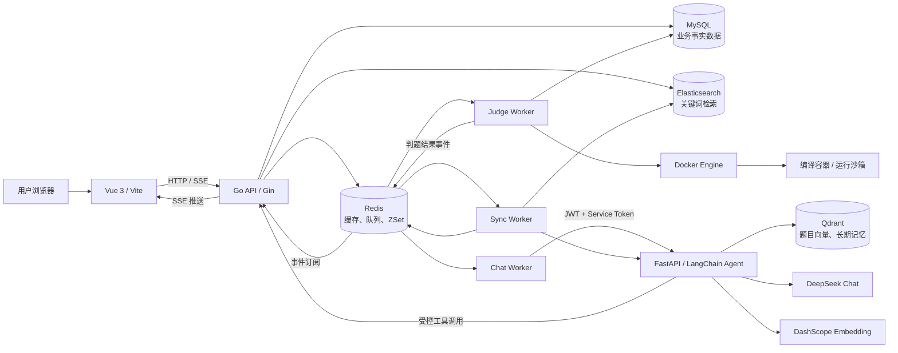

# Gojo OJ

Gojo OJ 是一个面向算法学习场景的在线判题与 AI 学习助手平台。项目使用 Go + Gin 提供核心业务 API，以 Redis 承载缓存、异步任务和排行榜，通过 Docker Engine 隔离编译与运行用户代码，并结合 Elasticsearch、FastAPI、LangChain、Qdrant 和 DashScope Embedding 实现题目搜索、语义召回、错题分析及个性化学习建议。

项目覆盖题目管理、代码提交、异步判题、提交记录、排行榜、用户与权限管理、AI 多轮会话和管理后台等完整链路，适合作为 Go 后端工程、异步任务、容器沙箱与 RAG Agent 的综合实践项目。

## 核心能力

- **在线判题**：提交任务进入 Redis 队列，由 Go Worker 调用本地 Docker API 完成编译、逐用例运行与结果汇总。
- **资源隔离**：运行容器关闭网络，并限制 CPU、内存、进程数、执行时间和输出规模。
- **题目系统**：支持题目、标签、测试用例的管理，以及分页列表、详情、标签筛选和提交记录查询。
- **搜索与推荐**：Elasticsearch 服务后端关键词搜索，也是 Agent 混合召回中的词法通道；Qdrant 保存题目向量并提供语义召回。
- **AI 学习助手**：LangChain Agent 可调用 AC 记录、失败提交详情、标签统计和候选题等工具，完成错题分析、薄弱点总结与学习建议。
- **多轮记忆**：MySQL 保存完整会话和结构化回复，历史消息使用窗口与摘要压缩；Qdrant 保存用户长期向量记忆。
- **最终一致性同步**：题目变化后通过 Redis List 异步同步 Elasticsearch 和 RAG，用户 AC 后同步 Redis ZSet 排行榜，并提供重试、租约恢复、死信与定期校准。
- **双 Token 鉴权**：用户侧采用 Access Token + Refresh Token；Go 与 FastAPI 之间同时校验内部 Service Token 和受控 JWT。

## 系统架构


```mermaid
flowchart LR
    U["用户浏览器"] --> V["Vue 3 / Vite"]
    V -->|"HTTP / SSE"| G["Go API / Gin"]

    G --> M[("MySQL<br/>业务事实数据")]
    G --> R[("Redis<br/>缓存、队列、ZSet")]
    G --> E[("Elasticsearch<br/>关键词检索")]

    R --> JW["Judge Worker"]
    JW --> D["Docker Engine"]
    D --> C["编译容器 / 运行沙箱"]
    JW --> M
    JW -->|"判题结果事件"| R
    R -->|"事件订阅"| G
    G -->|"SSE 推送"| V

    R --> CW["Chat Worker"]
    CW -->|"JWT + Service Token"| F["FastAPI / LangChain Agent"]
    F -->|"受控工具调用"| G
    F --> Q[("Qdrant<br/>题目向量、长期记忆")]
    F --> L["DeepSeek Chat"]
    F --> B["DashScope Embedding"]

    R --> SW["Sync Worker"]
    SW --> E
    SW --> F
    SW --> R
```

### 组件职责

| 组件 | 主要职责 |
| --- | --- |
| Vue 3 | 用户端与管理后台，维护双 Token，通过 SSE 接收回合状态和判题通知 |
| Go / Gin | 公网业务 API、认证授权、题目与提交管理、判题入队、Chat 调度、内部 Agent 工具接口；不持有 Docker Socket |
| Judge Worker | 无公网端口的独立 Go 服务，消费判题队列并通过 Docker Engine 创建编译和运行沙箱 |
| MySQL / GORM | 用户、题目、测试用例、提交、会话、消息、回合和反馈等事实数据 |
| Redis | 旁路缓存、提交限流、判题队列、Chat 队列、同步队列和排行榜 ZSet |
| Docker Engine | 编译用户代码，并在受限容器内执行测试用例 |
| Elasticsearch | 题目关键词检索、标签精确筛选，以及 Agent 混合召回中的词法候选 |
| FastAPI / LangChain | Agent 编排、工具调用、结构化输出、会话摘要和 RAG 同步入口 |
| Qdrant | 题目向量集合和按用户隔离的长期会话记忆 |
| DeepSeek | Chat Agent 推理模型 |
| DashScope Embedding | 题目、查询和长期记忆向量化 |

## 核心业务链路

### 异步判题

1. 用户调用 `POST /api/submit`，提交题目 ID、语言和源代码。
2. Go API 先把提交记录写入 MySQL，再将任务写入 Redis List `judge:pending`。
3. 独立 Judge Worker 协程池通过 Lua 原子地将任务从 Pending 移到 Processing 并设置租约，再通过 Docker SDK 连接宿主机 Docker Engine。
4. 编译阶段在 `golang:alpine` 容器内分别编译用户代码和内置判题 Runner。用户代码编译失败返回 `CE`，Runner 编译失败视为系统错误。
5. 编译成功后，为本次提交创建关闭网络的运行沙箱；多个测试用例通过 Docker Exec 依次执行，避免重复创建容器。
6. `ContainerExecAttach` 提供本次 Exec 的实时输出流，`stdcopy.StdCopy` 将 Docker 复用流拆分为 `stdout` 和 `stderr`；Runner 输出 JSON 形式的退出码、信号、耗时、内存与程序输出。
7. 判题服务依次判断系统错误、超时、内存超限、运行错误和输出差异，遇到首个失败用例后停止。
8. 最终状态由 Judge Worker 写回 MySQL，并通过 Redis Pub/Sub 发布 `judge_result`；API 订阅后转发 SSE，提交结果查询接口作为通知丢失时的兜底。

| 状态 | 含义 |
| --- | --- |
| `AC` | Accepted，答案正确 |
| `WA` | Wrong Answer，输出不匹配 |
| `CE` | Compile Error，用户代码编译失败 |
| `RE` | Runtime Error，非零退出或异常信号 |
| `TLE` | Time Limit Exceeded，运行超时 |
| `MLE` | Memory Limit Exceeded，内存超限 |
| `SE` | System Error，Docker、Runner 或基础设施错误 |

判题沙箱当前实施的主要限制：

- `NetworkMode=none`，禁止用户代码访问网络。
- 限制内存，并将 Memory Swap 设置为相同上限，避免额外交换空间。
- 通过 `NanoCPUs` 限制 CPU，通过 `PidsLimit` 限制进程数量。
- 编译和运行均有外层 Context 超时；用例还检查 Runner 上报的 CPU 时间、墙钟时间和最大常驻内存。
- 用户代码与判题 Runner 分开编译，因此能够区分用户编译错误和判题基础设施错误。
- 编译和运行容器带有 `gojo.sandbox=true`、所属环境、类型和提交 ID Label；服务启动、Judge Worker 开始消费前会按当前环境的 Label 强制清理上次异常退出留下的容器，并清理 `TMPDIR` 下的 `judge_*` 工作目录。

> 当前语言适配器只支持 Go，运行镜像为 `golang:alpine`。扩展 C++、Java 或 Python 时，需要为每种语言提供独立镜像、编译命令、运行命令和资源策略。

### 题目搜索与数据同步

MySQL 是题目与用户积分的事实数据源。题目新增、修改、删除或标签变化后，业务服务向 Redis 写入 ES 与 RAG 同步任务；用户首次 AC 后写入排行榜同步任务。

| Redis Key | 数据结构 | 用途 |
| --- | --- | --- |
| `sync:pending` | List | 等待消费的同步任务 |
| `sync:processing` | List | 已领取但尚未确认的任务 |
| `sync:processing:leases` | ZSet | Processing 任务的租约到期时间 |
| `sync:retry_at` | ZSet | 按下次执行时间排序的重试任务 |
| `sync:dead_letter` | List | 超过重试次数或无法解析的任务 |

Worker 通过 Lua 脚本原子地将任务从 Pending 移到 Processing 并设置租约。成功后 ACK；失败后按 `1m、5m、30m、2h、12h` 退避，最多重试 8 次。后台协程定期提升到期重试、恢复租约超时任务，并每 30 分钟从 MySQL 发起全量校准。

- **Elasticsearch**：同步 `problems_current` Alias 指向的 IK 索引。查询对 `title^3` 和 `description` 执行 `multi_match`，通过 `tags` 精确筛选。
- **Qdrant RAG**：Sync Worker 调用 FastAPI 的 `/rag/problems/sync` 或 `/rag/problems/delete`；FastAPI 从 Go API 读取题目，调用 DashScope 生成向量后写入 Qdrant。
- **排行榜**：Redis ZSet `leaderboard:infrastructure` 以用户 ID 为 member，以 `solved_count * 10` 为 score。全量重建先写临时 Key，再通过 `RENAME` 原子替换。

这套机制提供的是**最终一致性**而非分布式事务：MySQL 提交成功不代表 ES、Qdrant 与排行榜立即可见。生产环境应监控 Pending、Retry、Processing 和 Dead Letter，并提供受控死信重放能力。

### AI Chat、错题分析与学习建议

AI 能力统一收敛在 Chat 会话中，不再依赖独立 Study Plan 任务：

1. 用户创建 Chat Session 并发送消息。
2. Go 后端保存用户消息和 `chat_turns`，再把回合写入 `chat_turn_queue`。
3. Chat Worker 领取任务，写入 Processing Token 与租约，并调用 FastAPI `/chat/run`。
4. FastAPI 使用 LangChain `create_agent` 和 `ChatDeepSeek` 执行 Tool Calling。
5. Agent 按意图读取 AC 历史、失败提交、失败代码与实际输出、标签统计和候选题目。
6. 自然语言找题优先融合 Elasticsearch 关键词召回与 Qdrant 语义召回，再执行确定性重排。
7. Go 将展示文本写入 `chat_messages.content`，将原始结构写入 `structured_payload` 和 Turn Result。
8. 前端通过 SSE 监听回合状态，连接异常时回退轮询；回合完成后可继续对话或提交反馈。

Agent 的主要工具：

- `user_ac_history`：读取已通过题目。
- `user_failed_submissions`：读取最近失败提交。
- `failed_submission_detail`：读取失败代码、状态、实际输出、题面和标签，用于具体错题分析。
- `user_tag_stats`：统计不同标签的通过情况。
- `candidate_problems`：按标签获取未完成候选题。
- `semantic_candidate_problems`：从 Qdrant 获取语义候选。
- `hybrid_candidate_problems`：融合 Elasticsearch 和 Qdrant 结果并重排。

结构化输出：

```json
{
  "answer": "面向用户的分析或建议",
  "weak_tags": ["动态规划", "图论"],
  "recommended_problems": [
    {
      "problem_id": 42,
      "title": "示例题目",
      "reason": "推荐原因"
    }
  ],
  "response_type": "analysis"
}
```

Go 端保留最近消息窗口，并将较早消息压缩为 Session Summary；FastAPI 还会从 Qdrant 检索当前用户的长期记忆。长期记忆按 `user_id` 隔离，默认召回 Top 3。

### Agent 工具访问边界

Go 调用 FastAPI 时携带：

- `Authorization: Bearer <JWT>`：由 Go 为受控的活动管理员服务账号签发。
- `X-Agent-Service-Token: <shared-secret>`：Go 与 FastAPI 共享的内部密钥。

FastAPI 回调 Go 的内部 Agent API 时继续携带这两个凭据。工具执行器将用户 ID 强制绑定为原始 Chat 请求中的用户，模型不能通过参数切换用户；失败提交详情接口还会在 Go 端校验提交归属，并拒绝把 AC 提交作为错题分析目标。

## 缓存与排行榜

项目只对明确的热点读取使用旁路缓存：

| Key | TTL | 内容与失效策略 |
| --- | --- | --- |
| `cache:problems:page:{page}:limit:{limit}:tag:{tag}` | 1 小时 | 题目分页；题目或标签变化后批量失效 |
| `cache:problem:detail:{id}` | 24 小时 | 题目详情；题目、标签、测试用例或判题统计变化后失效 |
| `cache:tags:all` | 7 天 | 标签列表；标签新增或删除后失效 |
| `rate_limit:submit:{user_id}` | 5 秒窗口 | 用户提交限流 |
| `leaderboard:infrastructure` | 持久 | 全局排行榜，由增量同步和周期校准维护 |

题目列表缓存不保存用户个性化的 `is_ac`。命中公共缓存后，服务仍会查询当前用户在本页题目的 AC 集合，避免不同用户之间串数据。

### 内测限流

默认配置面向少量熟人内测：单 IP 每小时最多发起 3 次注册，全站每个中国时区自然日最多成功注册 10 人；单用户每 5 秒最多提交 1 次、每小时最多 60 次，AI Chat 每日最多 2 条消息。登录、搜索、SSE Ticket 和同时 SSE 连接也有独立配额，详见 `config/config.production.example.yaml` 中的 `rate_limit`。限流计数保存在 Redis；Redis 不可用时会拒绝受限接口，而不是绕过限流。

## 技术栈

| 层次 | 技术 |
| --- | --- |
| 前端 | Vue 3、Vue Router、Axios、Vite |
| Go 后端 | Go 1.26、Gin、GORM、go-redis、Docker SDK、Elasticsearch Go Client |
| Python Agent | Python、FastAPI、LangChain、langchain-deepseek、Pydantic |
| 数据存储 | MySQL、Redis、Elasticsearch 8.11、Qdrant |
| AI 服务 | DeepSeek Chat、DashScope `text-embedding-v3` |
| 容器与运行 | Docker、Docker Compose |

## 项目结构

```text
.
├── agent/                     # FastAPI、LangChain Agent、工具执行与 RAG
│   ├── app.py                 # Agent HTTP 入口与服务鉴权
│   ├── langchain_runner.py    # Agent、摘要与长期记忆编排
│   ├── tool_executor.py       # 工具边界、混合召回与重排
│   └── rag/                   # Qdrant 索引、检索、记忆和导入工具
├── cmd/
│   ├── server/                # Go HTTP API、Chat/Sync Worker 启动入口
│   ├── judge_worker/          # 无公网端口的独立判题 Worker 入口
│   └── seed_problems/         # 示例题目初始化命令
├── config/                    # 多环境配置加载与示例
├── infrastructure/           # MySQL、Redis、Elasticsearch 客户端
├── internal/
│   ├── app/                   # 路由、中间件、统一响应与错误码
│   ├── chat/                  # Session、Message、Turn、Feedback 与 Worker
│   ├── judge/                 # Docker 编译、Runner、限制和判题服务
│   ├── leaderboard/           # Redis ZSet 排行榜
│   ├── problem/               # 题目、标签、测试用例、缓存和 ES 搜索
│   ├── submission/            # 提交记录与判题任务入队
│   ├── syncer/                # ES、RAG、排行榜最终一致性任务
│   └── user/                  # 双 Token、封禁和用户资料
├── migrations/                # 需人工确认执行的历史 SQL
├── vue/                       # Vue 用户端和管理后台
├── docker-compose.yml         # 本地开发中间件与 Agent
├── docker-compose.prod.yml    # 单机生产服务拓扑
├── docker-compose.4g.yml      # 4GB 主机的低内存叠加配置
├── .env.example              # 开发环境变量示例
├── .env.local-production.example # 生产 Compose 环境变量模板
├── LOCAL_PRODUCTION.md        # 本机生产模式与 4GB 配置说明
└── go.mod                     # Go 模块与依赖
```

## 本地运行

### 环境要求

- Go 1.26，以 `go.mod` 为准
- Node.js 18+ 与 npm
- Docker Desktop 或 Docker Engine
- MySQL 8.x
- DeepSeek API Key
- DashScope API Key

> `docker-compose.yml` 只启动 Agent、Redis、Elasticsearch、Kibana 和 Qdrant，不包含 MySQL、Go 后端与 Vue 前端。

### 1. 创建数据库

```sql
CREATE DATABASE gojo
  CHARACTER SET utf8mb4
  COLLATE utf8mb4_unicode_ci;
```

Go 后端启动时使用 GORM `AutoMigrate` 创建或补齐当前模型表。生产环境建议改为版本化迁移。

### 2. 配置 Go 后端

```powershell
Copy-Item config\config.example.yaml config\config.dev.yaml
```

`APP_ENV` 默认是 `dev`，因此读取 `config/config.dev.yaml`。至少填写：

```yaml
sql:
  dsn: "root:password@tcp(127.0.0.1:3306)/gojo?charset=utf8mb4&parseTime=True&loc=Local"

jwt:
  secret: "replace-with-a-long-random-secret"

elasticsearch:
  addresses:
    - "http://localhost:9200"

chat:
  worker_count: 3
  agent_base_url: "http://localhost:8000"
  agent_timeout_seconds: 120
  agent_service_token: "replace-with-another-long-random-secret"
```

配置可以通过 `GOJO_` 环境变量覆盖，层级中的点转换为下划线，例如 `GOJO_SERVER_PORT`、`GOJO_REDIS_ADDR` 和 `GOJO_SQL_DSN`。

### 3. 配置并启动中间件与 Agent

```powershell
Copy-Item .env.example .env
```

填写 DeepSeek 和 DashScope Key，并在 `.env` 中补充：

```dotenv
AGENT_SERVICE_TOKEN=replace-with-another-long-random-secret
```

该值必须与 `chat.agent_service_token` 完全相同，否则 Chat 和 RAG 同步会返回 `401`。

### 生产环境密钥要求

上线时设置 `APP_ENV=prod`（或 `production`）。仓库提供可提交、无密钥的 `config/config.production.example.yaml`：Docker 生产镜像会将它作为 `config.production.yaml` 使用，并由 `GOJO_*` 环境变量注入密钥。若直接运行 Go 程序，请先复制该模板为本机私有的 `config/config.production.yaml`。Go 后端会在连接数据库前拒绝启动，除非下列三个值均为至少 32 个字符的随机值：`jwt.secret`、`chat.agent_service_token`、`redis.password`。Agent 也会拒绝使用空、过短或示例形式的 `AGENT_SERVICE_TOKEN` 启动。

`chat.agent_service_token` 与 `.env` 中的 `AGENT_SERVICE_TOKEN` 必须完全一致；JWT Secret 和 Redis 密码必须分别独立生成，不能复用。可用密码管理器或 `openssl rand -hex 32` 生成随机值，且不要提交本机的 `config.production.yaml` 或 `.env`。

```bash
docker compose up -d --build
docker compose ps
docker pull golang:alpine
```

| 服务 | 默认地址 |
| --- | --- |
| FastAPI Agent | `http://localhost:8000` |
| Redis | `localhost:6379` |
| Elasticsearch | `http://localhost:9200` |
| Kibana | `http://localhost:5601` |
| Qdrant HTTP | `http://localhost:6333` |

### 4. 初始化管理员账号

Chat Worker 初始化时要求数据库至少存在一个 `role=1`、`status='active'` 且 `token_version > 0` 的用户。生产 Compose 提供一次性 `bootstrap-admin` 工具：在私有环境文件中填写 `BOOTSTRAP_ADMIN_USERNAME` 和 `BOOTSTRAP_ADMIN_PASSWORD` 后执行：

```bash
docker compose --env-file .env.local-production -f docker-compose.prod.yml --profile tools run --rm bootstrap-admin
```

用户名必须为 3-32 个字符，密码必须为 12-72 字节。工具不会覆盖或提升同名普通用户；重复执行时，若该账号已经是启用的管理员，会安全退出。初始化成功后应从环境文件清空 `BOOTSTRAP_ADMIN_PASSWORD`。

### 5. 启动 Go API 与 Judge Worker

在两个终端分别运行：

```bash
go mod download
go run ./cmd/server
```

```bash
go run ./cmd/judge_worker
```

API 默认监听 `http://localhost:8080`，初始化 MySQL、Redis 和 Elasticsearch，启动 Chat、Sync Worker 与 Redis 实时事件桥接，但不连接 Docker。Judge Worker 不开放 HTTP 端口，负责初始化 Docker Client、启动判题协程池、恢复过期任务，并在开始消费前回收当前环境的残留判题容器。

### 6. 启动前端

```bash
cd vue
npm install
npm run dev
```

Vite 默认监听 `http://localhost:3000`，将 `/api` 请求（包括 SSE）代理到 `http://localhost:8080`。

### 7. 健康检查

```bash
curl http://localhost:8080/ping
curl http://localhost:8000/ping
curl http://localhost:9200
curl http://localhost:6333/collections
```

## 4GB 云服务器部署

`docker-compose.prod.yml` 是完整的单机生产拓扑，`docker-compose.4g.yml` 是必须与它同时使用的叠加配置。后者将 Judge 和 Chat Worker 并发数降为 1，收紧 MySQL 连接池、缓存和各容器内存上限，保留 Elasticsearch、Qdrant、AI 与完整判题功能。它不会创建另一套服务，而是按服务名合并并覆盖资源参数。

推荐主机基线为 4 vCPU、4 GiB 内存、40 GB 磁盘和 2 GB Swap。该配置面向少量用户的内测，不代表高并发或强隔离的多租户生产方案。首次部署：

```bash
git clone https://github.com/white0range/w0r_oj.git
cd w0r_oj
cp .env.local-production.example .env.local-production
stat -c '%g' /var/run/docker.sock
```

编辑 `.env.local-production`：替换 MySQL 密码和三个至少 32 字符的独立 Secret，填写 `DEEPSEEK_API_KEY`、`DASHSCOPE_API_KEY` 和管理员初始密码，再将上一条命令的数字结果写入 `DOCKER_GID`。不要将这个私有环境文件提交到 Git。

```bash
docker pull golang:alpine
docker compose --env-file .env.local-production \
  -f docker-compose.prod.yml \
  -f docker-compose.4g.yml \
  config --quiet
docker compose --env-file .env.local-production \
  -f docker-compose.prod.yml \
  -f docker-compose.4g.yml \
  up -d --build
docker compose --env-file .env.local-production \
  -f docker-compose.prod.yml \
  -f docker-compose.4g.yml \
  --profile tools run --rm bootstrap-admin
```

初始化完成后立即从环境文件清空 `BOOTSTRAP_ADMIN_PASSWORD`，然后检查：

```bash
docker compose --env-file .env.local-production \
  -f docker-compose.prod.yml \
  -f docker-compose.4g.yml \
  ps
curl -fsS http://127.0.0.1:8088/ping
docker stats --no-stream
```

Compose 网关默认只绑定 `127.0.0.1:8088`。公网上线时应在宿主机配置 Nginx 或 Caddy，将域名的 HTTPS 请求反向代理到该地址；安全组只开放必要的 `22`、`80`、`443` 端口，不要暴露 API 容器、MySQL、Redis、Elasticsearch、Qdrant 或 Docker Socket。更完整的本地验证、停机与排错命令见 [LOCAL_PRODUCTION.md](LOCAL_PRODUCTION.md)。

> 生产模板默认不信任任何代理 CIDR，因此在 Compose 网关后所有访客可能共享同一个 IP 限流配额。这对小规模内测偏保守但安全；如果需要精确的用户源 IP 限流，应先为 Docker 网络固定子网，再仅将网关的 IP/CIDR 加入 `server.trusted_proxy_cidrs`，不要盲目信任所有代理。

## 关键配置

### Go 配置

| 配置前缀 | 说明 |
| --- | --- |
| `server` | API 端口和 HTTP 超时 |
| `sql` | MySQL DSN 与连接池 |
| `redis` | Redis 地址、密码和 DB |
| `jwt` | Access Token 与内部 Agent JWT 的签名密钥 |
| `elasticsearch` | Elasticsearch 节点 |
| `judge` | 判题 Worker 数和编译超时 |
| `chat` | Chat Worker 数、Agent 地址、超时与内部 Service Token |

### Agent 环境变量

| 变量 | 默认值或用途 |
| --- | --- |
| `DEEPSEEK_API_KEY` | DeepSeek API Key，必填 |
| `DEEPSEEK_API_BASE` | 默认 `https://api.deepseek.com` |
| `LLM_MODEL` | 默认 `deepseek-chat` |
| `GO_BACKEND_BASE_URL` | Agent 容器访问 Go API，默认 `http://host.docker.internal:8080` |
| `AGENT_SERVICE_TOKEN` | 内部密钥，必须与 Go 配置一致 |
| `DASHSCOPE_API_KEY` | DashScope Embedding Key，必填 |
| `EMBEDDING_MODEL` | 默认 `text-embedding-v3` |
| `EMBEDDING_DIMENSION` | 默认 `1024`，修改后需重建 Qdrant Collection |
| `QDRANT_URL` | Compose 内默认 `http://qdrant:6333` |
| `MEMORY_COLLECTION` | 默认 `chat_memories` |
| `MEMORY_TOP_K` | 默认 `3` |
| `AGENT_DEBUG` | 调试日志开关，生产环境应关闭 |

## API 概览

受保护接口需携带 `Authorization: Bearer <access_token>`。

| 模块 | 方法与路径 | 权限 | 说明 |
| --- | --- | --- | --- |
| 健康检查 | `GET /ping` | 公开 | Go 服务健康检查 |
| 认证 | `POST /api/register` | 公开 | 注册 |
| 认证 | `POST /api/login` | 公开 | 登录并获取双 Token |
| 认证 | `POST /api/refresh` | 公开 | 刷新 Token |
| 认证 | `POST /api/logout` | 公开 | 注销 Refresh Session |
| 题目 | `GET /api/problems` | 公开/可选登录 | 分页、标签筛选和用户 AC 状态 |
| 题目 | `GET /api/problems/:id` | 公开 | 题目详情 |
| 搜索 | `POST /api/problems/search` | 公开 | ES 关键词与标签搜索 |
| 提交 | `POST /api/submit` | 登录 | 创建提交并进入判题队列 |
| 提交 | `GET /api/submissions/:id` | 登录 | 查询自己的提交 |
| 提交 | `GET /api/my-submissions` | 登录 | 个人提交记录 |
| 排行榜 | `GET /api/leaderboard` | 公开/可选登录 | Top 50 与个人排名 |
| 实时通知 | `POST /api/events/ticket` | 登录 | 获取 60 秒有效、一次性的判题通知 SSE Ticket |
| 实时通知 | `GET /api/events?ticket=...` | Ticket | SSE 推送判题结果 |
| Chat | `POST /api/chat/sessions` | 登录 | 创建会话 |
| Chat | `GET /api/chat/sessions` | 登录 | 会话列表 |
| Chat | `GET /api/chat/sessions/:id/messages` | 登录 | 会话消息 |
| Chat | `POST /api/chat/sessions/:id/messages` | 登录 | 发送消息并创建回合 |
| Chat | `GET /api/chat/turns/:id` | 登录 | 查询回合状态 |
| Chat | `POST /api/chat/turns/:id/stream-ticket` | 登录 | 获取绑定该回合的一次性 SSE Ticket |
| Chat | `GET /api/chat/turns/:id/stream?ticket=...` | Ticket | SSE 监听回合 |
| Chat | `POST /api/chat/turns/:id/feedback` | 登录 | 提交 ChatPlanFeedback |
| 管理后台 | `/api/admin/*` | 管理员 | 用户、题目、标签与测试用例管理 |
| Agent 工具 | `/api/admin/agent/*` | 管理员 + Service Token | FastAPI 内部工具调用 |

## 数据模型

- `users`：用户、角色、状态、已解决题数与 Token Version。
- `problems`、`tags`、`test_cases`：题目、标签关系与测试数据。
- `submissions`：代码、语言、状态、输出、耗时与内存。
- `chat_sessions`：会话元数据和历史摘要。
- `chat_messages`：用户/助手消息与结构化 Payload。
- `chat_turns`：异步回合、状态、租约和结果。
- `chat_plan_feedbacks`：用户对已完成 Chat 回合的反馈。

旧版 Study Plan 表不再由当前代码使用。确认旧表没有有效数据后，可执行：

```bash
mysql -u root -p gojo < migrations/20260718_remove_legacy_study_plan_tables.sql
```

## 测试与构建

### Go

```bash
go test -count=1 ./...
go build ./...
```

判题集成测试需要本地 Docker Engine 和 `golang:alpine` 镜像。

### Python

```bash
python -m compileall agent
```

宿主机直接运行 Agent：

```bash
python -m pip install -r agent/requirements.txt
uvicorn app:app --app-dir agent --host 0.0.0.0 --port 8000
```

### 前端

```bash
cd vue
npm run build
```

## 运维与排障

### RAG 同步返回 401

确认 `.env` 中存在 `AGENT_SERVICE_TOKEN`，并与 Go 配置完全相同。修改后重建 Agent：

```bash
docker compose up -d --build agent
```

### 判题无法连接 Docker

- 确认 Docker Desktop/Engine 正在运行。
- 确认独立 Judge Worker 正在运行；API 本身不应连接 Docker。
- 确认 Judge Worker 有权限访问 Docker API。
- Linux 环境检查 Judge Worker 对 `/var/run/docker.sock` 的组权限。
- 使用 `docker version` 和 `docker image inspect golang:alpine` 验证连接与镜像。

### Chat 长时间停留在 Pending 或 Running

- 检查 `chat_turn_queue` 和 `chat_turn_processing`。
- 检查 Go 到 Agent 的连通性，以及 Agent 到 `GO_BACKEND_BASE_URL` 的反向连通性。
- 检查活动管理员服务账号、JWT Secret 和 Service Token。
- Chat Worker 以数据库状态为事实来源，并使用 Processing Token、租约续期和超时扫描恢复陈旧回合。

### 中文搜索召回较弱

ES 使用与 `elasticsearch:8.11.0` 匹配的 IK 插件。`title` 和 `description` 显式使用 `ik_max_word` 建立索引、`ik_smart` 查询；应用通过 `problems_current` Alias 读写版本化的 `problems_ik_v1` 索引。首次升级会从 MySQL 全量重新同步题目到新索引；确认搜索正常后，旧的动态 Mapping `problems` 索引可手动删除。

### 同步队列积压

```bash
redis-cli LLEN sync:pending
redis-cli LLEN sync:processing
redis-cli ZCARD sync:retry_at
redis-cli LLEN sync:dead_letter
redis-cli ZCARD leaderboard:infrastructure
```

不要直接删除 Processing 或 Dead Letter。应先定位 ES、Agent、Embedding 或 Qdrant 错误，再通过受控流程重放。

## 安全与生产化边界

- Docker Socket 是高权限系统接口。公网 API 已移除 Socket，只有不开放端口的 Judge Worker 持有；同机部署仍共享宿主机内核，公网多租户阶段应继续评估独立 Judge 节点和更严格的容器运行时。
- 当前判题只支持 Go，并依赖公共 `golang:alpine`。生产环境应固定镜像 Digest 并预拉取到 Judge 节点。
- Redis List 是项目内实现的轻量可靠队列，不等同于 Kafka 或 RabbitMQ；需要补充监控、死信重放、幂等审计和容量规划。
- Elasticsearch 与 Qdrant 是最终一致性副本，业务写入和搜索可见之间存在延迟。
- API Key、JWT Secret、MySQL 密码和 Service Token 不应提交 Git，应由 Secret Manager 或部署平台注入。
- `AGENT_DEBUG` 在生产环境应关闭，避免日志包含模型输入、工具结果或用户代码。
- FastAPI Agent 当前使用同步请求模式，高并发场景应评估异步 HTTP、模型限流、熔断、超时与成本预算。
- GORM AutoMigrate 适合开发环境，正式部署应使用可审计、可回滚的版本化迁移。

## 判题服务隔离与后续改进

公网 API 与 Judge Worker 已拆分为两个独立进程。API 只创建 `Pending` 提交并写入 Redis 可靠判题队列，不初始化 Docker Client，也不挂载 `/var/run/docker.sock`。Judge Worker 不开放公网端口，按固定沙箱配置创建容器、写回 MySQL，并通过 Redis Pub/Sub 发布轻量结果事件；API 订阅事件后转发 SSE，前端查询提交结果作为兜底。

当前架构：

```text
Browser -> Gateway -> API -> Redis judge queue -> Judge Worker -> Docker Engine
                           |                    |
                           v                    v
                         MySQL <----------- judge result

Judge Worker -> Redis Pub/Sub event -> API -> SSE / polling -> Browser
```

后续强化项：

1. 将 Judge Worker 与 Docker Engine 迁移到独立主机或私有网络节点，使容器逃逸不直接影响业务 API 和数据库所在主机。
2. 为 Worker 配置最小权限数据库账号，只允许读取题目和测试用例、更新判题相关字段。
3. 在现有固定 Label 与单实例启动清理基础上补充周期性清理、容器数量与资源监控、任务审计和受控死信重放；多 Worker 部署时清理必须结合实例归属和任务租约。
4. 评估 rootless Docker、user namespace、定制 seccomp/AppArmor、gVisor 或其他更强隔离运行时。
5. 如果判题通知需要离线重放，将当前最佳努力的 Redis Pub/Sub 升级为 Redis Stream；MySQL 仍保持最终结果的事实来源。
